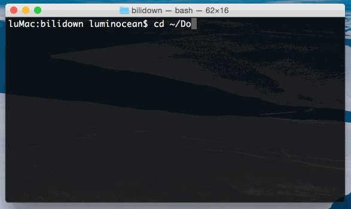

# Bilidown
基于Node.js的B站视频下载器

### 基本用法 - 作为独立的可执行文件使用

在bin目录下可以找到可执行文件bilidown，该文件即可独立执行的脚本程序

Usage: bilidown [options]

  Options:

    -h, --help               output usage information
    -V, --version            output the version number
    -u, --url [url]          The url of the video page
    -d, --dir [directory]    The directory to which videos will be saved (absolute or relative). Default to the current execution directory.
    -n, --nth [page_number]  The number of the subpage you want to download the video from.(In the case where one video page has multiple subpages) Default to 1

示例（进入bilidown目录后）：
bin/bilidown -d downloads -n 2 -u http://www.bilibili.com/video/av2474781/

这行命令将下载该页面的第二个视频到当前目录下的downloads文件夹下

当bilidown被全局安装后（参见安装部分），可以在任意位置直接使用bilidown命令

> 在Windows环境下，需要显式使用node指令来执行该脚本，如 node bin/bilidown

### 基本用法 - 作为node模块使用

除了作为独立的可执行文件运行以外，bilidown还可以作为一个标准的node模块内嵌到其他程序中使用
具体用法可参见bin/bilidown文件

在执行bilidown.downloadPageVideo()后会返回一个EventEmitter，可以在其上调用on函数监听事件：
> progress: 下载过程中触发，会传入一个progress对象，其中progress.current表示已下载的字节数，progress.total表示总共需要下载的字节数
> end: 下载完成后触发
> error: 下载发生错误后触发

基于这些事件可以基于下载过程添加一定程度的功能，bin/bilidown就是在其上添加了基于命令行简单地下载动画效果

### 安装

首先确认安装了Node.js与npm工具，参考 https://nodejs.org 与 https://www.npmjs.com

git clone以后，在项目目录下执行`npm install`安装依赖后即可使用

在项目目录下执行 sudo npm install -g . 可以把bilidown安装到全局，从而可以在命令行中直接使用bilidown运行
